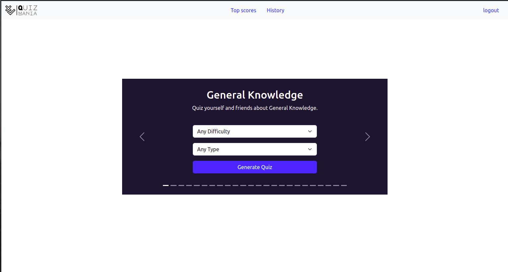

# Quizmania

Welcome to Quizmania! This project aims to provide platform where users can test their knowledge on different topics with lots
of fun.

## Features

 - Login: Users can login in if they have account
 - Signup: Users can sign up if they don't account
 - Generate quiz: This allows registered to generate quiz of the topic they choose
 - Submit quiz: Registered can submit answers of the generated quiz
 - View score: Users can see their previous scores
 - Leader board: This contains top 10 users with the highest score
 - logout: Users can logout
 
## Demo




## Installation
To install the project, follow these steps:

```
git clone https://github.com/omar-ao/Quizmania.git
cd Quizmania
pip3 install virtualenv
virtualenv .venv
source .venv/bin/activate
pip install -r requirements.txt
cat set_mysql_dev_db | mysql -hlocalhost -uroot -p
source set_env_variables
./run.py
```
